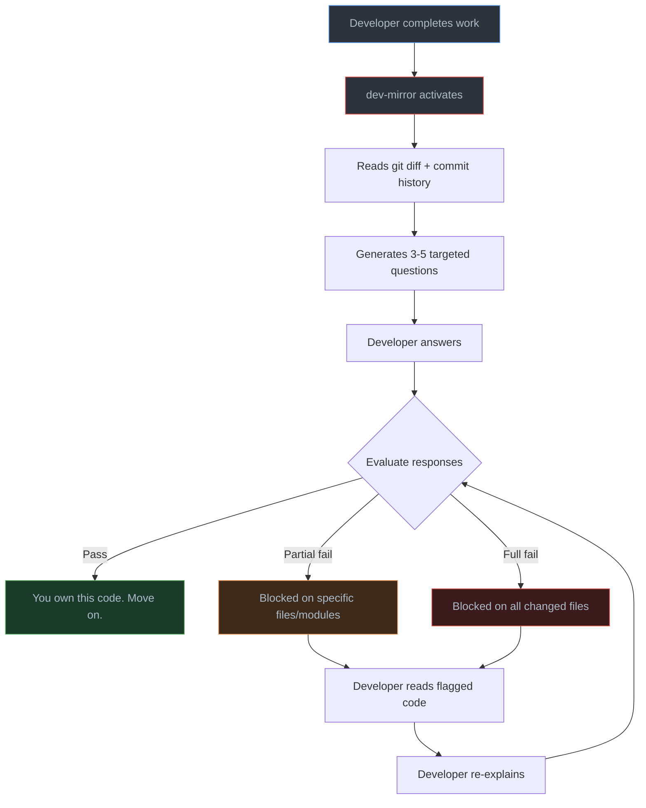
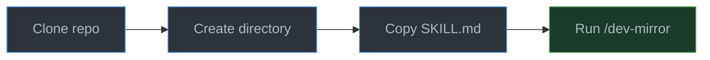
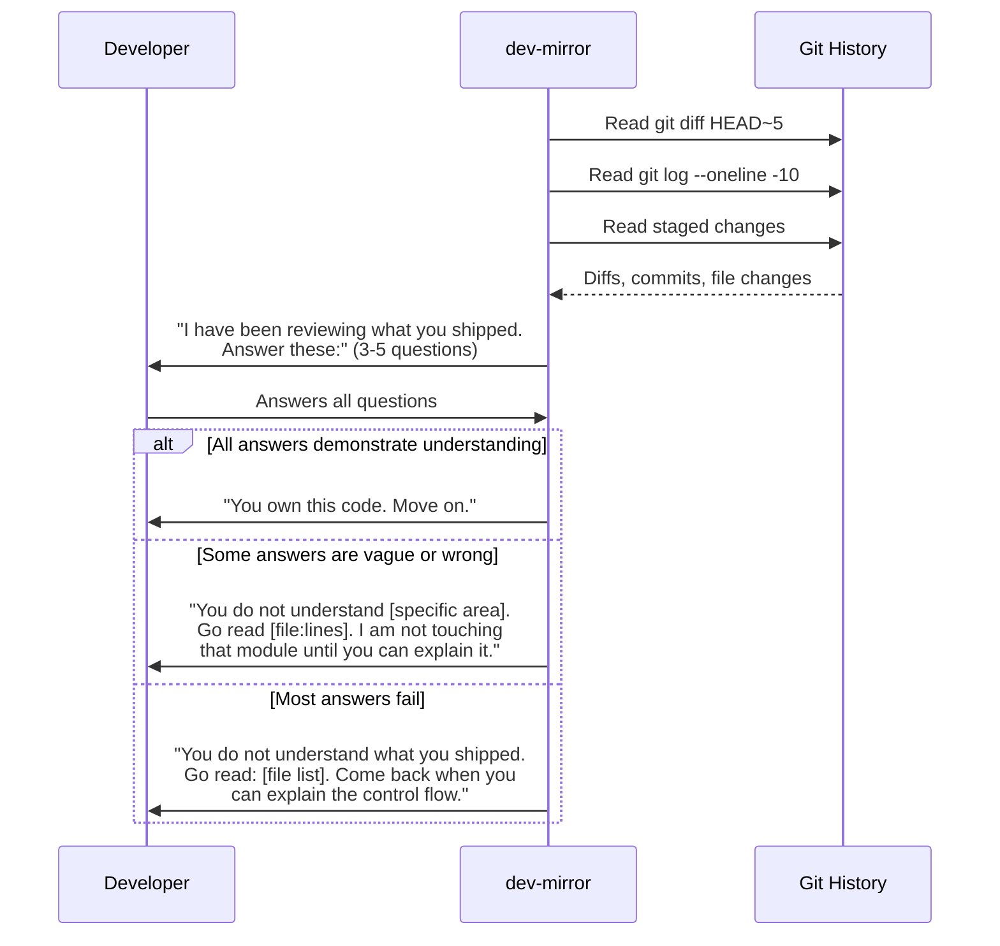
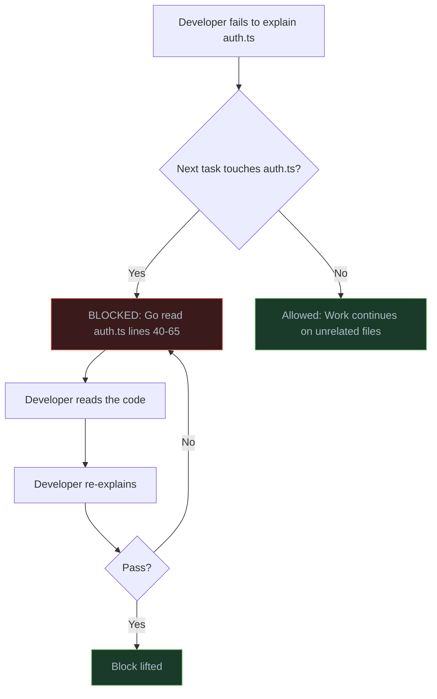

<div align="center">

# dev-mirror

**The anti-vibe-coding skill for Claude Code.**

Quizzes you on your own code to make sure you actually understand what you shipped — not just what Claude built.

[](LICENSE)
[](https://docs.anthropic.com/en/docs/claude-code)
[](#how-it-works)

---

</div>

## The Problem

You are shipping code you cannot explain. Your AI assistant writes it, you approve it, and it works — until it doesn't. When it breaks, you stare at functions you supposedly authored but cannot trace through. dev-mirror exists to prevent that.

## How It Works

dev-mirror reads your actual git diffs and commit history, generates pointed questions about the code you just touched, and evaluates whether you truly understand it. If you cannot explain what you shipped, it blocks you from writing more code in that area until you can.



> [!IMPORTANT]
> dev-mirror never gives you the answer. It tells you what to go read. The understanding has to come from you.

---

## Quick Start

### 1. Clone the repository

```bash
git clone https://github.com/nourdesouki/dev-mirror.git
```

### 2. Create the skill directory

```bash
mkdir -p ~/.claude/skills/dev-mirror
```

### 3. Copy the skill file

```bash
cp dev-mirror/skill/SKILL.md ~/.claude/skills/dev-mirror/SKILL.md
```

### 4. Verify installation

Open Claude Code in any project and run:

```
/dev-mirror
```

That is it. No configuration, no database, no dependencies.



> [!NOTE]
> dev-mirror installs as a personal skill at `~/.claude/skills/`. It is available across all your projects automatically.

---

## Usage

### Manual Trigger

Run it whenever you want to test yourself:

```
/dev-mirror
```

Focus on a specific area:

```
/dev-mirror auth module
/dev-mirror database queries
/dev-mirror error handling in api routes
```

### Automatic Trigger

dev-mirror auto-activates when Claude detects you have completed a significant milestone — finished a feature, fixed a bug, or are wrapping up a session. No configuration required.

---

## Quiz Session Flow

A typical session follows this sequence:



> [!WARNING]
> If you fail to explain code in a specific file or module, dev-mirror will refuse to write, edit, or generate code in that area until you demonstrate understanding. This block is enforced, not suggested.

---

## What Gets Asked

dev-mirror generates questions from six categories, always referencing specific files, functions, and line numbers from your actual diffs.

| Category | What it tests | Example |
|:---|:---|:---|
| **Why** | Intent behind design choices | *"You added a `retryCount` parameter to `fetchWithBackoff()`. Why is the default 3 and not configurable via env var?"* |
| **What Breaks** | Failure mode awareness | *"If `processQueue()` receives an empty array at line 47, what happens? Walk me through the execution path."* |
| **Dependency Awareness** | Understanding of ripple effects | *"You modified `calculateTotal()`. What other files call that function, and how does your change affect them?"* |
| **Edge Cases** | Boundary condition coverage | *"Your validation checks for expired tokens. What happens if the token is malformed — not expired, structurally invalid?"* |
| **Design Decisions** | Justification for approach | *"You used a Map instead of a plain object in `cache.ts` at line 23. Why? What is the practical difference here?"* |
| **Deletion Awareness** | Responsibility after removal | *"You deleted the `sanitizeInput()` call from `routes/upload.ts`. Where is sanitization happening now?"* |

> [!TIP]
> Questions are generated from your actual diffs. Generic software engineering knowledge will not help you. You have to know your code.

---

## Hard Block Enforcement

When you fail a question, the block is scoped — not global.



**Rules:**
- Blocks are scoped to the specific files and modules you failed on
- Unrelated work continues without restriction
- Blocks lift only when you demonstrate real understanding
- dev-mirror will never give you the answer

---

## Coverage Tracking

dev-mirror uses Claude's memory system to track which areas of your codebase have been quizzed. On each invocation, it:

1. Checks which files and functions have already been tested
2. Prioritizes untested code paths
3. Rotates coverage so blind spots get surfaced — not just the obvious stuff
4. Records results for future sessions

This means repeated runs will not ask the same questions. Coverage expands over time to ensure you understand your entire codebase, not just the parts you are most comfortable with.

---

## Development Session with dev-mirror

This is what a typical development session looks like with dev-mirror integrated:

```mermaid
gantt
    title Development Session Timeline
    dateFormat HH:mm
    axisFormat %H:%M

    section Coding
    Implement auth middleware        :done, code1, 08:00, 10:00
    Fix token validation bug         :done, code2, 10:00, 11:30
    Add rate limiting                :done, code3, 12:30, 14:30
    Refactor error handling          :done, code4, 15:30, 17:00
    Write integration tests          :done, code5, 17:00, 18:00

    section dev-mirror
    Auto-trigger after auth          :crit, quiz1, 11:30, 12:00
    Auto-trigger after rate limiting :crit, quiz2, 14:30, 15:00
    Manual /dev-mirror end of day    :crit, quiz3, 18:00, 18:30

    section Knowledge Gaps
    Read auth.ts lines 40-65         :active, gap1, 12:00, 12:30
    Re-explain auth flow             :milestone, pass1, 12:30, 12:30
    Read rateLimit.ts error paths    :active, gap2, 15:00, 15:30
    Re-explain rate limiter          :milestone, pass2, 15:30, 15:30
```



---

## Project Structure

```
dev-mirror/
  skill/
    SKILL.md        # The skill file — copy this to ~/.claude/skills/dev-mirror/
  docs/
    examples.md     # Example quiz sessions showing what to expect
  LICENSE
  README.md
```

---

## Uninstall

```bash
rm -rf ~/.claude/skills/dev-mirror
```

---

## License

[MIT](LICENSE)

---

<div align="center">

**If you understood your code, the tone would not matter.**

</div>
